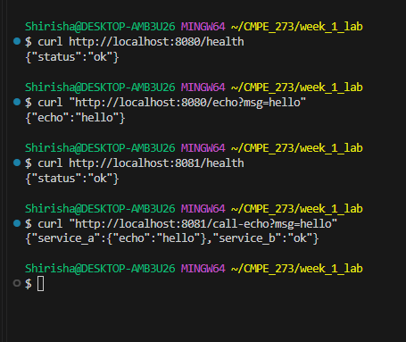
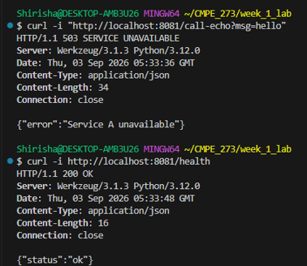

# CMPE 273 – Week 1 Lab 1: Your First Distributed System

Two independent Python Flask services that communicate over HTTP.

- **Service A** (port `8080`) — `/health`, `/echo?msg=...`
- **Service B** (port `8081`) — `/health`, `/call-echo?msg=...` (calls Service A over HTTP using the `requests` library)

## Run Service A

```bash
cd python-http/service-a
pip install -r requirements.txt
python app.py
```

## Run Service B (new terminal)

```bash
cd python-http/service-b
pip install -r requirements.txt
python app.py
```

## Test

With both services running:

```bash
curl http://localhost:8080/health
# {"status":"ok"}

curl "http://localhost:8080/echo?msg=hello"
# {"echo":"hello"}

curl http://localhost:8081/health
# {"status":"ok"}

curl "http://localhost:8081/call-echo?msg=hello"
# {"service_a":{"echo":"hello"},"service_b":"ok"}
```

Service logs (stdout) show each request with service name, endpoint, HTTP status, and latency:

```text
service=service-a endpoint=/echo status=200 latency_ms=0.00
service=service-b endpoint=/call-echo status=200 latency_ms=4.24
```



## Failure Demonstration

Stop **only** Service A (`Ctrl+C`) and rerun the call-echo command to observe failure handling — leave Service B running.

```bash
curl -i "http://localhost:8081/call-echo?msg=hello"
```

Result:

```text
HTTP/1.1 503 SERVICE UNAVAILABLE

{"error":"Service A unavailable"}
```

Service B logs the downstream failure:

```text
service=service-b endpoint=/call-echo error="Service A unavailable: HTTPConnectionPool(...)"
service=service-b endpoint=/call-echo status=503 latency_ms=1011.01
```

Service B's own health check still works, proving it did not crash:

```bash
curl -i http://localhost:8081/health
# HTTP/1.1 200 OK
# {"status":"ok"}
```



## What Makes This Distributed?

This application is distributed because Service A and Service B run as separate processes and communicate through HTTP over the network instead of directly calling each other's functions. Each service can run or fail independently. Service B depends on Service A for the echo operation, but if Service A becomes unavailable, Service B keeps running, handles the network failure with a timeout, and returns HTTP 503 instead of crashing.


